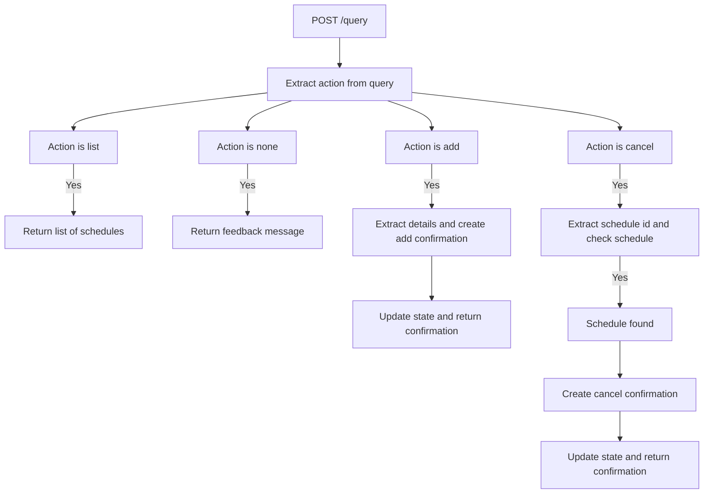
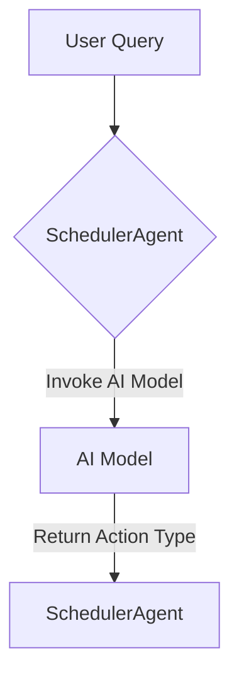
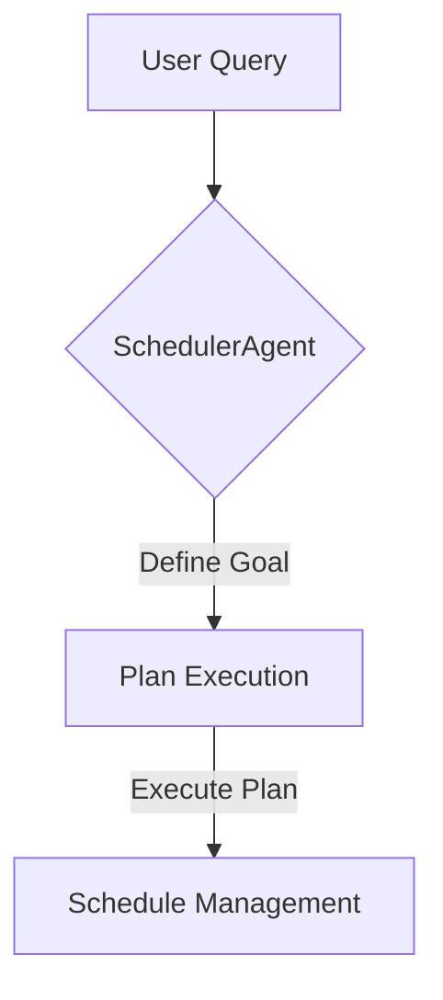
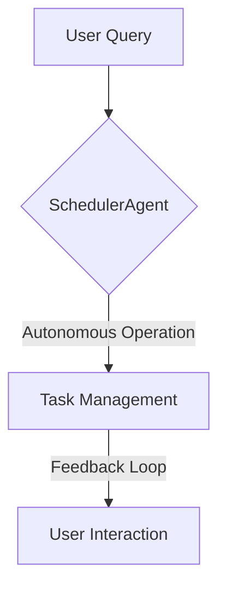

# Agent Scheduler

Agent Scheduler is a sophisticated application designed to manage scheduling operations using AI-driven decision-making. It allows users to add, cancel, and list scheduled tasks through natural language queries, leveraging advanced language models to interpret and execute user commands.

## Table of Contents
- [Overview](#overview)
- [Usage](#usage)
- [Architecture](#architecture)

## Overview
The Agent Scheduler is built to facilitate dynamic scheduling tasks by interpreting natural language inputs. It uses AI models to determine the type of scheduling action required, such as adding, cancelling, or listing tasks. The application is structured around a central `SchedulerAgent` class that manages the state and operations of scheduling tasks.

## Architecture
The Agent Scheduler is an application that uses a combination of AI models and a durable object pattern to manage scheduling tasks. The core component is the `SchedulerAgent`, which handles the state and logic for scheduling operations.

### Flow Chart


### Agentic Patterns
The project employs several agentic patterns:

#### Tool Use Pattern
The SchedulerAgent dynamically interacts with external AI models to interpret user queries and determine scheduling actions.



#### Planning Pattern
The SchedulerAgent formulates and executes plans based on user queries, aligning with real-time goals.



#### Autonomous Agent
The SchedulerAgent operates autonomously, managing tasks dynamically and seeking feedback from the environment.



## Usage
To start the project locally, use the following command:
```
npx nx dev agent-scheduler
```

### NPM Scripts
- **deploy**: Deploys the application using Wrangler.
```
npx nx deploy agent-scheduler
```
- **dev**: Starts the development server.
```
npx nx dev agent-scheduler
```
- **lint**: Lints the codebase and throws errors on warnings.
```
npx nx lint agent-scheduler
```
- **start**: Starts the development server.
```
npx nx start agent-scheduler
```
- **test**: Runs the test suite.
```
npx nx test agent-scheduler
```
- **test:ci**: Runs the test suite in CI mode.
```
npx nx test:ci agent-scheduler
```
- **type-check**: Checks TypeScript types without emitting files.
```
npx nx type-check agent-scheduler
```

### API Endpoints
The application exposes the following API endpoints:

#### POST /query
- **Description**: Processes a user query to determine the scheduling action.
- **Request Format**:
  ```jsonc
  {
    "agentId": "string",
    "prompt": "string"
  }
  ```
- **Response Format**:
  ```jsonc
  {
    "confirmation": {
      "id": "string",
      "action": "string",
      "schedule": {
        "type": "string",
        "date": "string",
        "time": "number",
        "cron": "string"
      }
    },
    "message": "string"
  }
  ```
- **Curl Command**:
  ```bash
  curl -X POST \
    -H "Content-Type: application/json" \
    -d '{"agentId": "your-agent-id", "prompt": "your-query"}' \
    http://localhost:8787/query
  ```

#### POST /confirmations/:confirmationId
- **Description**: Confirms or rejects a pending scheduling operation.
- **Request Format**:
  ```jsonc
  {
    "agentId": "string",
    "confirm": "boolean"
  }
  ```
- **Response Format**:
  ```jsonc
  {
    "schedule": "Schedule",
    "message": "string",
    "result": "boolean"
  }
  ```
- **Curl Command**:
  ```bash
  curl -X POST \
    -H "Content-Type: application/json" \
    -d '{"agentId": "your-agent-id", "confirm": true}' \
    http://localhost:8787/confirmations/your-confirmation-id
  ```

<!-- Last updated: 7464b99c788378d693a45c25b97b3bbd024699c6 -->
